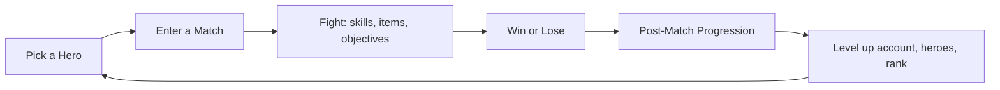

# Gameplay Overview

Debellum: Last Party is, at its heart, a competitive action game. The economy and ownership layers exist to reward play — but the core loop is about heroes, skills, and winning matches.

## The core loop

Every match flows into a satisfying post-match sequence that updates six different progression systems at once — your rank, your account level, your hero mastery, and more.

## What you control in a match

- **A hero** with a unique kit of abilities and a combat archetype.
- **Skills** mapped to slots (basic attack, Q, W, E, ultimate, passive, plus item and special slots).
- **Items and equipment** bought and merged during the match.
- **Positioning and movement** across a map with fog of war, objectives, and (in Battle Royale) a shrinking safe zone.

## Sections in this part

| Page | What you'll learn |
|------|-------------------|
| [Game Modes](game-modes.md) | MOBA, Battle Royale, Ranked, Practice, and online vs. offline. |
| [Heroes & Archetypes](heroes.md) | The five hero archetypes and how star ranks shape their stats. |
| [Skills & Combat](skills-and-combat.md) | Skill slots, damage types, and how combat is calculated. |
| [Items & Equipment](items-and-equipment.md) | Buying, merging, and the role of buffs. |
| [Battle Royale](battle-royale.md) | Safe zones, extraction, and survival mechanics. |
| [Progression Systems](progression.md) | The six systems that reward you after every match. |

## A note on fairness

All combat runs on a **deterministic simulation** shared between the game client and the servers, using fixed-point math (never floating point) so that every player's game stays perfectly in sync. The authoritative outcome of a match is computed on the server, and the client predicts and animates locally for responsiveness. This is what keeps Debellum competitive and tamper-resistant.
