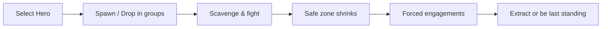

# Battle Royale

Battle Royale is Debellum's survival mode: multiple teams drop into a large map and fight to be the last standing as the playable area steadily shrinks. It uses the same heroes, skills, and combat engine as MOBA, but reframes them around scavenging, positioning, and survival.

## The match flow

## The safe zone

The defining mechanic of Battle Royale is the **safe zone** — a region that contracts over time. Staying inside keeps you safe; straying outside deals escalating damage that forces players toward the center and into each other.

- The zone shrinks in phases as the match progresses.
- Being caught outside the zone applies **safe-zone damage** that ramps up the longer you linger.
- Different zone shapes (including rectangular zones) keep encounters varied.

This pressure guarantees that matches reach a decisive climax rather than dragging on.

## Spawning and groups

Players enter in groups and are initialized at the start of each match. Battle Royale uses its own spawn and team-setup logic distinct from MOBA, tuned for the many-teams-one-map format.

## Loot, extraction, and revives

- **Loot & drops** — the map is seeded with items and drops to scavenge, letting you build power mid-match.
- **Extraction points** — objectives that update through the match and offer strategic goals beyond simply fighting.
- **Revives** — downed allies can be brought back under the mode's revive rules, rewarding teamplay and risk.

## Online vs. offline

| Variant | Opponents | Use |
|---------|-----------|-----|
| **Offline / local** | Bots | Learn the map, practice rotations, no server needed |
| **Online** | Real players | Full competitive networked matches |

Both run on the same deterministic simulation, so practicing offline translates directly to online play.

## Shared foundation

Although Battle Royale feels very different from MOBA, it is built on the same core engine. A dedicated set of systems — safe-zone changes, safe-zone damage, extraction updates, group spawning, and revives — activates only in this mode, layered on top of the shared hero, skill, and combat logic. That shared base is why the heroes you've mastered play identically here.
