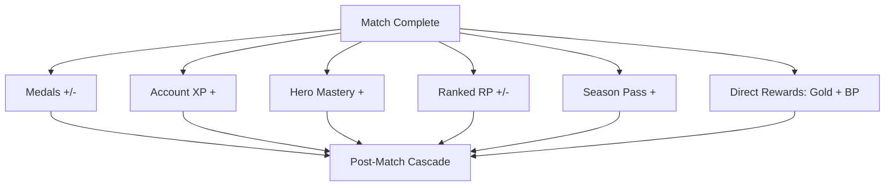

# Progression Systems

Debellum rewards you for playing through **six interconnected progression systems**. After every match, a single satisfying post-match sequence updates all of them at once. Some can go down as well as up (skill-measuring systems), while others only ever climb (time-and-effort systems).

## The six systems at a glance

| System | Measures | Direction | Resets? |
|--------|----------|-----------|---------|
| **Medals** | Match skill | Up **and** down | Skill-based |
| **Account XP** | Time played | Up only | Never |
| **Star Rank** | Hero investment | Up only | Never |
| **Hero Mastery** | Per-hero skill | Up only | Never |
| **Ranked (RP)** | Competitive standing | Up **and** down | Soft reset each season |
| **Season Pass** | Seasonal progress | Up only | Per season |

## Medals

Medals are Debellum's measure of raw match performance, and they can **rise or fall** depending on how you play. Medal totals unlock heroes and progress along the **Medal Road**, a milestone track that grants rewards (including hero shards and skin fragments) as your medal count grows.

## Account XP

Account XP accrues simply from **playing**, regardless of outcome, and **only goes up**. It drives your account level, with milestone rewards and privileges along the way. A soft cap on daily match XP keeps progression healthy and discourages burnout.

## Star Rank

Star Rank is per-hero power, upgraded with **Hero Shards** and **Gold** from 1★ to 5★. Bonuses are tuned to each hero's archetype and are **capped at 5★** to protect competitive fairness. See [Heroes & Archetypes](heroes.md) for the bonus tables.

## Hero Mastery

Hero Mastery is a **15-level** track per hero that rewards focused, skillful play on that specific character. It grants badges and exclusive rewards, with a standout reward reserved for reaching the top rank (R15). Mastery measures *how well you play a hero*, complementing Star Rank's *how invested you are*.

## Ranked

Ranked is the competitive ladder. Wins and losses adjust your **Ranking Points (RP)**, moving you across seven tiers and their divisions. At the end of each season, RP undergoes a **soft reset** and players receive seasonal rewards based on their peak standing.

## Season Pass

The Season Pass is a **60-tier** reward track for each season. It shares XP with regular play, so simply playing advances it. It offers both a free track and a premium track, with the premium track unlocking additional cosmetics and currency.

## The post-match cascade

When a match ends, the server authoritatively computes every progression change in a single atomic transaction, then the client plays them back as a layered "dopamine cascade":

1. **Ranking + Medal change** (can be negative)
2. **Account XP + level progress** (positive)
3. **Hero Mastery progress** (positive)
4. **Ranked RP change** (can be negative)
5. **Season Pass progress** (positive)
6. **Direct rewards** — Gold + Bellum Points

This ordering deliberately mixes risk (Medals, RP) with steady gains (XP, Mastery, Season Pass) so every match ends on a rewarding note.

## How progression connects to the economy

Progression feeds the ownership economy without compromising fairness:

- **Medal Road** and matches grant **Hero Shards** and **Skin Fragments** — the materials for upgrades and the [Forge](../nft-economy/minting.md).
- **Direct rewards** include **Gold** and **Bellum Points**, the soft currencies that fund boxes, crafting, and the [BP economy](../nft-economy/currencies.md).
- Match performance can also feed **on-chain ACP rewards** — see [Play-to-Earn](../nft-economy/play-to-earn.md).

Because all power progression is capped and server-authoritative, these rewards enrich your collection and identity without letting anyone buy their way to a competitive advantage.
