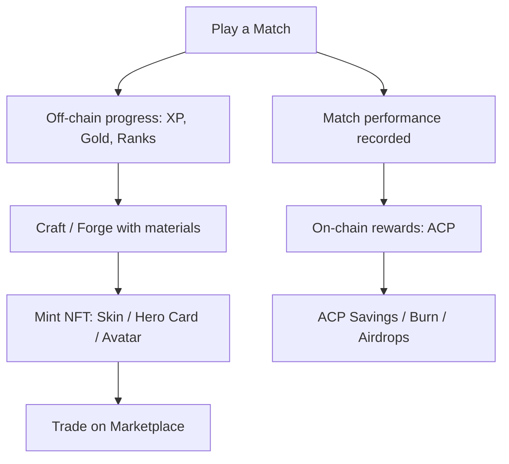

# Core Concepts

A few key ideas explain how Debellum balances a fast, fair game with real digital ownership. Understanding these makes the rest of this book easy to follow.

## On-chain vs. off-chain

Not everything in Debellum lives on a blockchain — and that is by design. Putting every action on-chain would be slow and expensive. Instead, the game splits data deliberately:

| Stays off-chain (instant, free) | Lives on-chain (owned, tradeable) |
|---------------------------------|-----------------------------------|
| XP, account level, mastery, star ranks | NFT titles & achievement proofs |
| Gold, Gems, Bellum Points (BP) | Forged premium / signature NFT skins |
| Hero shards, skin fragments | Rare+ box cosmetics with limited supply |
| Account-bound cosmetics and shop items | NFT avatars and hero cards |

The rule of thumb: **gameplay progress is off-chain; durable, tradeable value is on-chain.**

## The three soft currencies + one token

| Currency | Type | Earned from | Spent on |
|----------|------|-------------|----------|
| **Gold** | Off-chain | Matches, Medal Road, Season Pass | Star ranks, standard boxes, forging |
| **Gems** | Off-chain | Season Pass, purchases | Premium/Legendary boxes, mythic forging |
| **Bellum Points (BP)** | Off-chain | Betting wins, playing matches | Bellum Box, BP Shop |
| **ACP** | **On-chain token** | Match rewards, airdrops, savings interest | Minting, crafting sinks, marketplace |

ACP is the connective tissue of the on-chain economy. The soft currencies keep day-to-day play frictionless. See [Currencies](../nft-economy/currencies.md) for the full breakdown.

## NFT asset classes

Debellum mints several distinct kinds of NFTs, each with its own role:

| Asset class | Standard | Role |
|-------------|----------|------|
| **Avatar** | ERC-721 | Player identity / profile picture |
| **Skin** | ERC-1155 | Hero cosmetic appearance |
| **Hero Card** | ERC-721 | Proof of hero ownership / unlock |
| **Plant Flag** | ERC-721 | Objective / status cosmetic |
| **Skill Card** | — | Collectible tied to hero skills |

More detail in [NFT Assets](../nft-economy/nft-assets.md).

## Multi-chain by default

The economy is not tied to a single blockchain. Wallet connection and asset trading are supported across several major chains, with marketplace integrations spanning multiple platforms.

- **Chains supported:** Ethereum, zkSync, Immutable zkEVM, BSC, Metis, Ronin, and Gate Chain.
- **Marketplaces integrated:** OpenSea, Element, and Immutable.
- **Roadmap:** a dedicated low-cost layer (MegaETH L2) with **sponsored gas**, so common actions like minting can be free for the player.

## Server authority and fairness

To keep play fair, the client never has the final say on anything that matters:

| Action | Client role | Server role |
|--------|-------------|-------------|
| Showing your currency | Cached display | Authoritative sync |
| Upgrading a hero | Sends a request | Validates resources, applies change |
| Opening a box | Sends a request | Rolls the drop (incl. pity), returns result |
| Match outcome | Predicts/animates | Authoritative calculation |

Combat itself runs on a **deterministic, lockstep simulation** shared by client and server, which keeps matches synchronized and tamper-resistant. On top of that, the economy includes anti-multi-account and anti-collusion safeguards.

## Putting it together

With these concepts in mind, the [Gameplay](../gameplay/README.md) and [NFT & Web3 Economy](../nft-economy/README.md) sections will make full sense.
