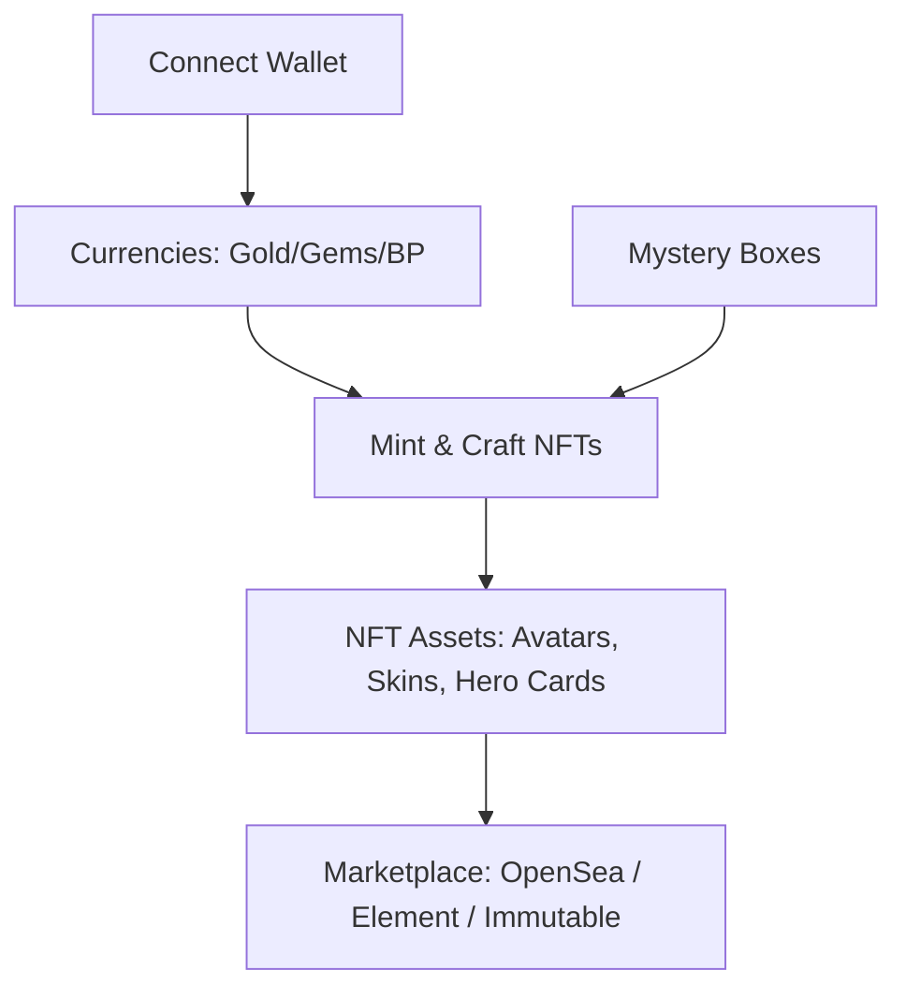

# NFT & Web3 Economy Overview

Debellum's economy is designed so that the things with lasting value — your identity, your rarest cosmetics, your achievements — are **truly owned by you** as on-chain NFTs, while everyday play stays instant and free.

## Guiding principle

> Gameplay progress is off-chain and free. Durable, tradeable value is on-chain and yours.

This split keeps matches fast and fair while giving players real ownership of the items worth owning.

## What lives on-chain

| On-chain (owned, tradeable) | Off-chain (instant, free) |
|-----------------------------|---------------------------|
| NFT avatars & identity | XP, levels, mastery, star ranks |
| Forged premium / signature skins | Gold, Gems, Bellum Points |
| Hero cards (ownership proofs) | Hero shards, skin fragments |
| Rare cosmetics with limited supply | Account-bound cosmetics & shop items |
| NFT titles (achievement proofs) | — |

## The pieces of the economy

## Sections in this part

| Page | What you'll learn |
|------|-------------------|
| [Wallet & Onboarding](wallet-and-onboarding.md) | Connecting a wallet, supported chains and providers. |
| [Currencies](currencies.md) | Gold, Gems, and Bellum Points. |
| [NFT Assets](nft-assets.md) | The asset classes you can own and trade. |
| [Minting & Crafting](minting.md) | Turning materials and items into NFTs. |
| [Marketplace](marketplace.md) | Listing, buying, and selling across platforms. |
| [Mystery Boxes](mystery-boxes.md) | Box tiers, drop rates, and the pity system. |

## Multi-chain at a glance

- **Chains:** Ethereum, zkSync, Immutable zkEVM, BSC, Metis, Ronin, Gate Chain.
- **Marketplaces:** OpenSea, Element, Immutable.
- **Wallets:** Immutable Passport, MetaMask (via Nethereum), TokenPocket, and WalletConnect-style flows.
- **Roadmap:** a dedicated **MegaETH L2** layer with sponsored gas, so common actions can be free for players.

## Fairness first

The economy is built to avoid pay-to-win. The most valuable NFTs are **cosmetic and identity** items, in-match power is **capped and server-authoritative**, and the system includes **anti-multi-account and anti-collusion** safeguards. Owning more does not mean winning more — it means expressing more.
