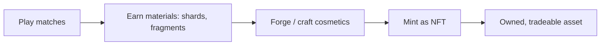

# Minting & Crafting

Minting is how in-game progress and materials become true on-chain NFTs. Crafting systems — chiefly the Fragment Forge — turn the materials you earn through play into cosmetics, and minting commits the best of them to the blockchain as assets you own.

## From play to ownership

## The Fragment Forge

The **Fragment Forge** consumes **Skin Fragments** (and Gold/Gems) to produce skins, scaling from Rare up to Mythic quality:

| Forge tier | Gold | Extra |
|------------|------|-------|
| Rare | 5,000 | — |
| Epic | 15,000 | — |
| Legendary | 40,000 | — |
| Mythic | 80,000 | + Gems |

Forged skins carry **generative traits**, so each result can be distinct. Premium-tier forged skins are the candidates for minting as tradeable NFT skins.

## Signature skins

Signature skins are a special, high-quality crafting result with **fixed, premium visual effects**, made via dedicated recipes (around 30,000 Gold). They represent the top end of cosmetic crafting and are designed to be standout collectibles.

## What you can mint

| Mint type | Source | Becomes |
|-----------|--------|---------|
| **Skin** | Fragment Forge / premium skins | ERC-1155 skin NFT |
| **Hero Card** | Hero ownership / progress | ERC-721 hero card NFT |
| **Avatar (head)** | Account / cosmetic progress | ERC-721 avatar NFT |
| **Plant Flag** | Objective achievements | ERC-721 flag NFT |
| **Skill Card** | Skill collectibles | Skill card NFT |

Each of these has a dedicated in-game minting flow with confirmation and success screens, so you always know exactly what you're committing on-chain.

## How minting works (behind the scenes)

When you mint, the game:

1. **Generates a unique token ID** for the item.
2. **Prepares metadata** — name, description, image, and attributes (including generative traits).
3. **Submits the mint transaction** to the appropriate chain.
4. **Records ownership** in the game's synchronized database once confirmed.

The result is an NFT in your wallet that the game recognizes immediately, applying any associated privileges.

## Cost and conditions

Minting may require:

- **Materials** (skin fragments) and/or **soft currency** (Gold/Gems) to craft the underlying item.
- **ACP** as an on-chain sink for the mint itself.
- Meeting any **mint conditions** (for example, hero-card requirements), which the game presents clearly before you commit.

## Roadmap: sponsored, batched minting

The planned **MegaETH L2** integration is designed to make minting effortless:

- **Sponsored gas** via a paymaster — the game can cover transaction fees, so minting can be **free for the player**.
- **Batch minting** — multiple mints combined into a single transaction for efficiency.
- **Rate limits and gas-spike pauses** to protect both players and the economy.

The goal is for minting to feel as simple as claiming a reward, while still producing a genuine on-chain asset you own.
