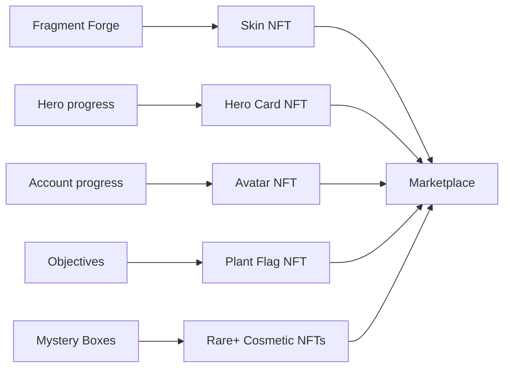

# NFT Assets

The NFTs in Debellum are the items worth truly owning — your identity, your rarest cosmetics, and proof of the heroes you've collected. Each asset class has a distinct role and follows a recognized token standard.

## Asset classes

| Asset class | Standard | Role |
|-------------|----------|------|
| **Avatar** | ERC-721 | Your profile identity / portrait. |
| **Skin** | ERC-1155 | A hero's cosmetic appearance. |
| **Hero Card** | ERC-721 | Proof of hero ownership / unlock. |
| **Plant Flag** | ERC-721 | Objective and status cosmetic. |
| **Skill Card** | — | Collectible tied to hero skills. |

## Avatars

Avatars are your on-chain identity in Debellum — the portrait that represents you to other players. They can be minted from in-game progress and held or traded. Because they're ERC-721 NFTs, each avatar is unique and provably yours. The game supports both avatars held in your bound in-game wallet and those held in an external wallet.

## Skins

Skins change how your heroes look in battle. Premium skins — especially those produced by the [Fragment Forge](minting.md) — can be minted as ERC-1155 NFTs, making them tradeable cosmetics with real scarcity. **Signature skins** are a special high-quality tier with fixed, distinctive visual effects, crafted via dedicated recipes.

## Hero Cards

Hero Cards are ERC-721 NFTs that represent ownership of a hero. They serve as a collectible and an unlock proof, and they tie into the on-chain reward economy — for example, hero-card sign-in rewards that grant ACP. Hero cards can be minted, collected, and traded, and the game tracks them as first-class NFT entities for each player.

## Plant Flags

Plant Flags are ERC-721 cosmetics connected to in-game objectives and status. Like other NFTs, they can be minted from gameplay achievements and traded on the marketplace.

## Skill Cards

Skill Cards are collectibles associated with hero skills, adding another dimension to collecting and to the on-chain economy.

## Rarity, tradeability, and supply

NFTs in Debellum carry attributes that define their value:

- **Rarity tiers** distinguish common cosmetics from rare, limited-supply pieces.
- **Tradeability flags** mark which items can be sold on the marketplace.
- **Limited supply** on rare+ items (for example, certain box cosmetics) gives them collectible scarcity.

Forged NFT skins carry **generative traits**, so each crafted skin can have its own distinguishing characteristics.

## Where assets come from

NFT assets enter your collection through several paths:

For how these are created, see [Minting & Crafting](minting.md). For how they're traded, see [Marketplace](marketplace.md).

## On-chain ownership, off-chain convenience

Ownership records live on-chain, but the game keeps a synchronized off-chain view (in its servers and database) so that your collection loads instantly and privileges tied to NFTs apply in real time. When an NFT is transferred or sold, the game updates ownership and any associated privileges automatically — so what you own on-chain is always reflected in-game.
