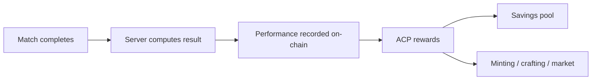

# Play-to-Earn

Debellum rewards play not only with progression and cosmetics, but with **on-chain value**. Match performance can feed into blockchain rewards, and the ACP token economy offers savings, airdrops, and sinks — all designed to reward engagement without compromising competitive fairness.

## From match results to on-chain rewards

When a match ends, the server computes the authoritative result — kills, assists, deaths, placement, and more. For wallet-connected players, this performance data can be pushed **on-chain**, recording results and feeding reward mechanisms.

## The ACP token economy

ACP is the engine of play-to-earn. Players earn and use it through several connected mechanisms:

| Mechanism | Description |
|-----------|-------------|
| **Match rewards** | Performance can translate into ACP rewards. |
| **Savings pool** | Hold ACP in a savings pool that accrues **daily interest**. |
| **Hero-card sign-ins** | Owning hero card NFTs grants ACP sign-in rewards. |
| **Burn mechanism** | ACP is removed from circulation through sinks to support token health. |
| **Airdrops** | Reward and influencer (KOL) programs distribute ACP. |

### Savings and interest

The savings pool lets players deposit ACP and earn interest over time, rewarding long-term participants and giving the token a productive use beyond spending.

### Burn and sinks

To balance the rewards flowing in, ACP also flows out through **sinks** — minting, crafting, and a dedicated **burn mechanism**. This two-sided design (rewards in, sinks out) is intended to keep the token economy sustainable rather than purely inflationary.

## Competitions and tournaments

Debellum's competitive layer ties into the on-chain economy:

- **Entry and eligibility** for certain tournaments can require owning specific NFTs (such as skins) or entry tickets.
- **Prize pools and donations** can be denominated in ACP, including ticket purchases and troop-assignment mechanics.
- **On-chain war rewards** distribute prizes to participants, surfaced through dedicated reward and mail screens.

This creates high-stakes competitive events where both skill and participation are rewarded on-chain.

## Airdrops and influencer programs

Dedicated programs distribute ACP (and BNB-denominated ACP) to communities and influencers (KOLs), broadening participation and rewarding those who grow the ecosystem.

## Fairness and sustainability

Play-to-earn is structured to **reward engagement, not spending advantage**:

- On-chain rewards are driven by **match performance**, computed by the authoritative server.
- In-match power remains **capped and server-authoritative** — earning more ACP does not make you stronger in a match.
- **Anti-multi-account and anti-collusion** safeguards (device fingerprinting, betting-pattern analysis, rate limits) protect the rewards system from abuse.
- The token's **sinks and burn** are designed to balance rewards, supporting long-term sustainability.

## Roadmap

The planned **MegaETH L2** integration aims to make the earn loop frictionless — **sponsored gas** so claiming and minting rewards can be free, and **batched transactions** for efficiency. The vision is an economy where playing well is genuinely rewarding on-chain, while the game stays fair, fast, and fun.
